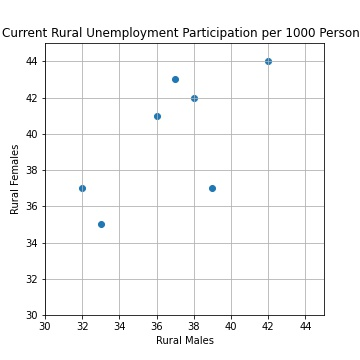
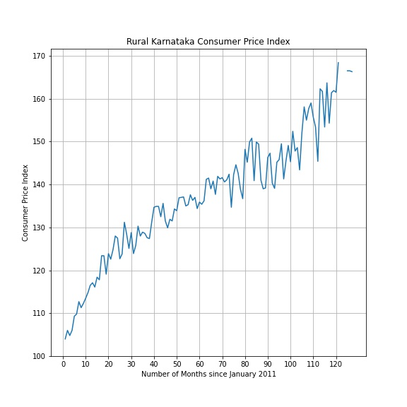

# Data Science Visualization

## Scatter Plot

### Data Set

Unemployment Per 1000 Persons: Type wise till June 2012 - Access [here](https://data.gov.in/catalog/unemployment-1000-persons)

The data set contains adjusted values for rural unemployment access for males and females at different strata.

### Scatter Plot

The scatter plot shows that the Current Week Rural Unemployment Access for Males and Females is roughly the same

## Line Plot

### Data Set

State Level Consumer Price Index Rural/Urban upto November 2021 - Access [here](https://data.gov.in/resource/state-level-consumer-price-index-ruralurban-upto-november-2021)

The data set contains CPI for all states of India at a monthly level from January 2011 upto November 2021. Multiple data points are missing and are maked NA.

### Line Plot

The line plot shows an increasing trend in the CPI for rural Karnataka from January 2011 onwards.
